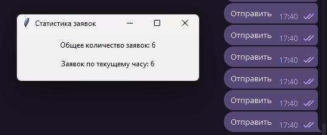

# Telegram Support Requests Counter

## Описание
Проект для автоматического подсчёта заданной фразы в Telegram. Система отслеживает заданное 
ключевое слово/фразу (например, "Отправить") и ведёт статистику повторений.

Пример использования: у компании имеется телеграмм бот, в котором техническая поддержка обрабатывает тикеты. Обработка
любого тикета заканчивается конкретным сообщением, например "Готово". Данный проект может помочь работникам подсчитывать
свой KPI на течение дня, не внося изменений в серверный код бота.

## Особенности
- Настраиваемое ключевое слово/фраза для счётчика
- Двойная статистика: общее количество и за текущий час
- Простое графическое отображение данных
## Установка
1. Клонируйте репозиторий:
```bash
git clone https://github.com/ForeverOnLol/BBtracker.git
cd BBtracker
```

2. Установите зависимости:
```
pip install -r requirements.txt
```

## Запуск и настройка

1. Сначала выполните авторизацию:
```bash
python login.py
```

* Введите API_ID и API_HASH с my.telegram.org
* Укажите ключевое слово/фразу для отслеживания

2. Запустите основное приложение:
```bash
python app.py
```

3. Попробуйте отправить ключевое слово/фразу в любой чат в tg.

## Скриншоты
